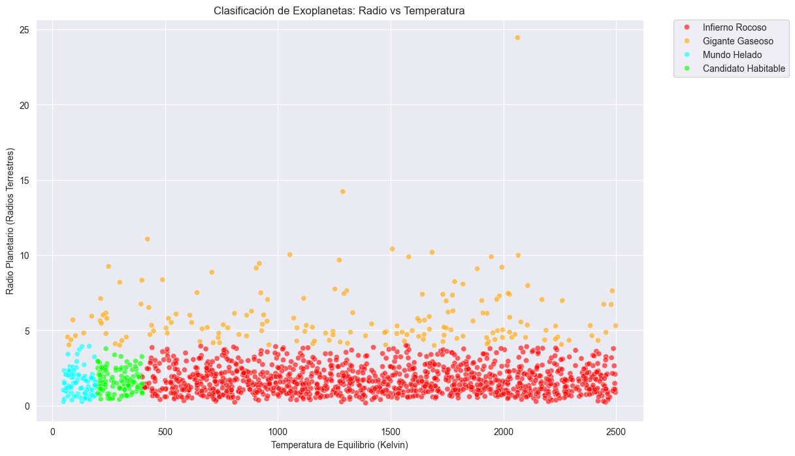

# 🪐 AstroInforme ML: Clasificación de Exoplanetas

## 🔭 Contexto: El Cuello de Botella del JWST
Las misiones como Kepler y TESS han descubierto miles de exoplanetas, pero solo una fracción son mundos rocosos templados capaces de albergar vida. El **Telescopio Espacial James Webb (JWST)** tiene la capacidad de analizar atmósferas, pero su tiempo de operación es extremadamente limitado y costoso.

**Objetivo:** Desarrollar un modelo de Machine Learning capaz de filtrar y priorizar automáticamente los candidatos más prometedores ("Candidatos Habitables") basándose en sus características físicas básicas.

## 📂 Dataset y Features
Se trabajó con un dataset sintético de **1,500 exoplanetas** generados bajo reglas astrofísicas simplificadas.

*   **Variables de Entrada ($X$):**
    *   `Radio_Re`: Radio del planeta (en Radios Terrestres).
    *   `Temperatura_K`: Temperatura de equilibrio (en Kelvin).
*   **Variable Objetivo ($y$):** Clasificación Multiclase.
    *   🔴 *Infierno Rocoso* (Caliente, Rocoso)
    *   🔵 *Mundo Helado* (Frío, Rocoso)
    *   🟠 *Gigante Gaseoso* (Radio masivo)
    *   🟢 *Candidato Habitable* (Zona 'Ricitos de Oro')

## 🧠 Metodología: K-Nearest Neighbors (KNN)
Dado que la clasificación depende de la posición del planeta en un espacio geométrico (Temperatura vs Radio), se eligió el algoritmo **KNN**.

### Preprocesamiento Crítico: StandardScaler
Debido a la diferencia de escalas (Temperatura en miles vs Radio en unidades), se aplicó estandarización (`StandardScaler`) para evitar que la temperatura dominara el cálculo de la distancia euclidiana.

### Mapa de Clasificación
Visualización de la distribución de clases generada:

## 📊 Resultados del Modelo
Se optimizó el modelo utilizando el **Método del Codo**, seleccionando **K=5** vecinos.

*   **Accuracy Global:** 98%
*   **Desempeño en Clase "Habitable":**
    *   **Recall (0.95):** El modelo logró identificar correctamente a 21 de los 22 candidatos habitables reales.
    *   **Precision (0.84):** Existieron algunos falsos positivos (planetas "Infierno" limítrofes clasificados erróneamente como habitables).

### Matriz de Confusión

[[ 21   0   1   0]  <- Candidato Habitable (Solo 1 perdido)
 [  0  32   1   0]  <- Gigante Gaseoso
 [  3   0 226   0]  <- Infierno Rocoso (3 confundidos con habitables)
 [  1   1   0  14]] <- Mundo Helado

 
##  🚀 Conclusiones

El modelo demostró ser altamente efectivo para la tarea de priorización astronómica.
*   **Alta Eficiencia**: Con un 98% de exactitud, el sistema puede ahorrar tiempo valioso del telescopio descartando automáticamente gigantes gaseosos y mundos extremos.
*   **Importancia del Escalado**: El éxito del algoritmo KNN dependió fundamentalmente de la estandarización de las variables físicas.

by: Alejandro Barrenechea
Basado en: Misiones Kepler/TESS